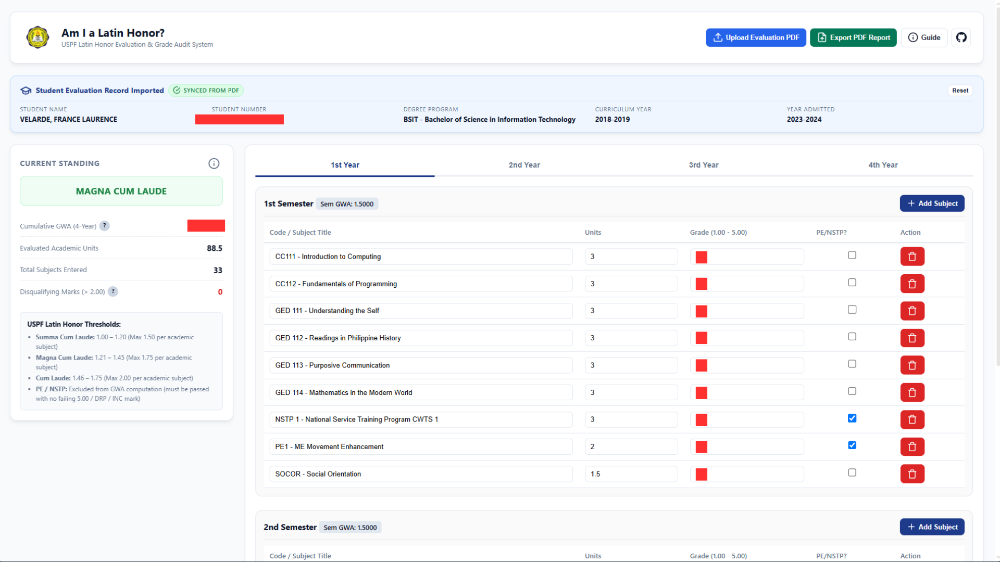

# Am I a Latin Honor?

**USPF Latin Honor Evaluation & Grade Audit System**

A self-evaluation web app for students of the **University of Southern Philippines Foundation (USPF)** to track their academic standing and determine their eligibility for Latin Honors based on the USPF Student Handbook.



> **Disclaimer:** This system is for self-evaluation purposes only and is based on the school's Student Handbook (Student Manual). Results may differ from official university evaluations.

---

## Features

- **PDF Import** - Upload your official USPF Evaluation PDF to auto-populate all subjects and grades
- **Supports all 4-year USPF degree programs** - Not just BSIT; any program with a standard USPF evaluation form works
- **Live GWA Computation** - Cumulative and per-semester GWA calculated in real time
- **Latin Honor Thresholds** - Automatically evaluates Summa Cum Laude, Magna Cum Laude, and Cum Laude eligibility
- **Disqualification Detection** - Flags any academic grade > 2.00, or PE/NSTP grades > 3.00
- **Session Persistence** - Your data survives a normal browser refresh (F5); clears only on hard refresh or new tab
- **PDF Export** - Export a printable audit report of your full evaluation
- **Manual Entry** - Add, edit, or delete subjects for any year and semester manually

---

## Latin Honor Thresholds (per USPF Student Handbook)

| Honor           | GWA Range   | Max Grade per Academic Subject |
| --------------- | ----------- | ------------------------------ |
| Summa Cum Laude | 1.00 - 1.20 | 1.50                           |
| Magna Cum Laude | 1.21 - 1.45 | 1.75                           |
| Cum Laude       | 1.46 - 1.75 | 2.00                           |

> **PE and NSTP** subjects are excluded from GWA computation but must have no failing (5.00), DRP, or INC marks.

---

## Getting Started

### Prerequisites

- [Python 3.8+](https://www.python.org/downloads/)
- [pip](https://pip.pypa.io/en/stable/)
- A modern web browser (Chrome, Edge, Firefox)

### 1. Clone the repository

```bash
git clone https://github.com/your-username/ailh.git
cd ailh
```

### 2. Install Python dependencies

```bash
pip install pdfplumber
```

### 3. Run the local server

```bash
python server.py
```

The app will be available at **http://localhost:8000**

> The Python server handles the `/api/parse-pdf` fallback endpoint. The app also has a fully client-side PDF parser (powered by PDF.js) that works without the server - useful for static hosting like GitHub Pages.

---

## Usage

### Upload an Evaluation PDF

1. Click **"Upload Evaluation PDF"** in the top-right header
2. Select your official USPF Evaluation Form PDF
3. The system auto-populates all subjects and grades across all 4 years and 2 semesters

### Manual Entry

- Click **"Add Subject"** in any semester block to add a new row
- Fill in the subject name, units, and grade (1.00 - 5.00)
- Check **PE/NSTP?** for physical education or NSTP subjects
- Missing grades are flagged with a red indicator badge - it disappears once a grade is entered

### Check Your Standing

The left **Current Standing** panel updates live showing:

- Your Latin Honor status (or disqualification reason)
- Cumulative 4-year GWA
- Total evaluated academic units
- Number of disqualifying marks

### Export a Report

Click **"Export PDF Report"** to generate a printable PDF audit summary.

### Resetting

Click **Reset** in the student info banner to clear all data and session storage.

---

## Project Structure

```
ailh/
|-- index.html          # Main web app (client-side parser, UI, GWA engine)
|-- styles.css          # Stylesheet
|-- parse_evaluation.py # Server-side USPF PDF parser (pdfplumber)
|-- server.py           # Lightweight Python HTTP server with /api/parse-pdf
|-- public/
|   |-- icon.svg        # Icon (used as favicon and header logo)
|   |-- sample.png      # App screenshot
|   |-- uspf.svg        # USPF logo (used as favicon and header logo)
|-- README.md           # This file
```

---

## Static Hosting (GitHub Pages)

The app is fully self-contained in `index.html` and works **without the Python server** thanks to the built-in PDF.js client-side parser. Simply deploy `index.html`, `styles.css`, and the `public/` folder to any static host.

The server-side `/api/parse-pdf` endpoint is only used as a fallback if the client-side parser fails.

---

## Developer

**France Laurence Velarde**
Last updated: August 16, 2026
